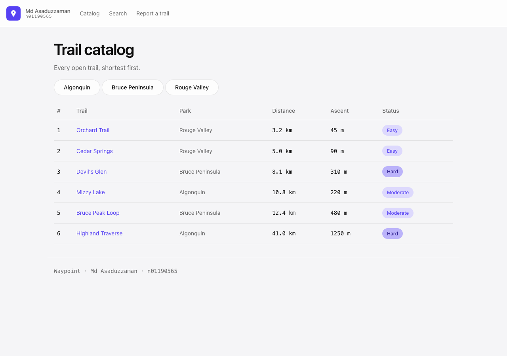
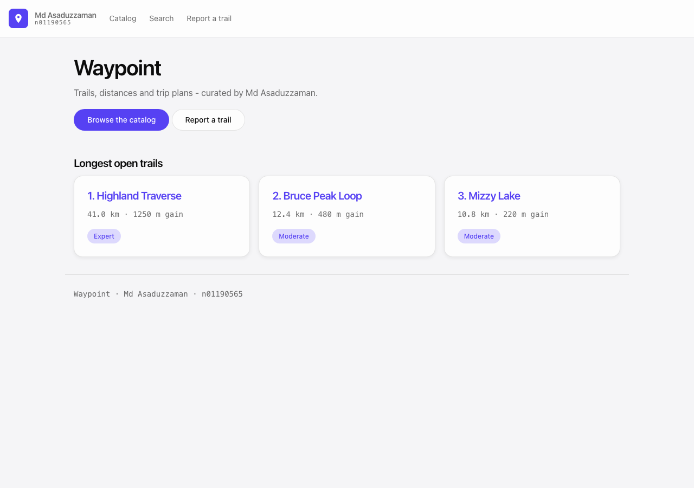
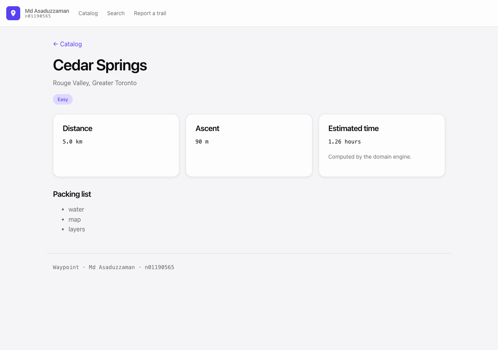
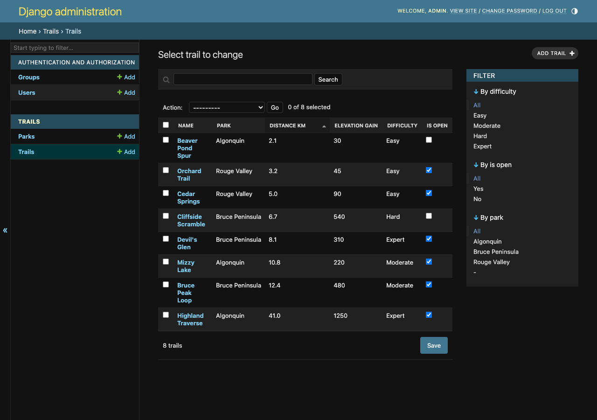

# Waypoint

A trail-finder and trip-planner: a pure-Python domain engine with a Django site built around it.

**Md Asaduzzaman — n01190565**
Application Programming (CCGC-5003-RNA), Summer 2026



---

## Quick start

```bash
python -m venv env
source env/bin/activate          # Windows: env\Scripts\activate
pip install -r requirements.txt
python manage.py migrate
python manage.py seed_trails     # optional: loads 3 parks and 8 trails
python manage.py runserver
```

Then open <http://127.0.0.1:8000/>.

To use the admin, create your own account:

```bash
python manage.py createsuperuser
```

Run the tests with:

```bash
python manage.py test
```

## Routes

| URL | Page |
|---|---|
| `/` | Homepage, with the three longest open trails |
| `/trails/` | Catalog — open trails only, shortest first |
| `/trails/<id>/` | One trail, with a time estimate from the engine |
| `/trails/?park=<id>` | Catalog narrowed to a single park |
| `/search/?q=` | Search open trails by name |
| `/report/` | Trail report form (CSRF-protected) |
| `/admin/` | Django admin |

## Layout

```
waypoint_core/      the domain engine — plain Python, no Django
  distance.py         Distance value type with full operator support
  trails.py           Trail (abstract) -> DayHike, BackpackingRoute, TrailRun,
                      GuidedDayHike, LoopTrail
  mixins.py           ElevationMixin, RatingMixin
  itinerary.py        Itinerary — HAS-A list of trails
  demo.py             python -m waypoint_core.demo
waypoint/           Django project — settings, root URLs, site views
trails/             Django app — models, admin, catalog and detail views
templates/          base.html + partials + one template per page
static/css/         the design system (tokens, then components)
```

## How the two halves connect

The engine is not a rehearsal for the site — the site imports it.
`Trail.as_domain()` rebuilds a database row as a `DayHike`, so the detail page's
time estimate comes from `waypoint_core`, not from view code:

```python
trail.estimated_time()   # -> DayHike.estimated_time()
```

`trails.models.Trail` also takes its difficulty choices straight from the
engine's `DIFFICULTIES` tuple, so the two halves cannot drift apart.

## Design decisions

**Mixed-unit arithmetic auto-converts** to the left operand's unit rather than
raising. Rejecting mixed units would make the common case — summing a catalog
whose rows arrived from different feeds — impossible without callers
normalising first, and the left operand is the unit the caller already chose.
Subtraction that would produce a negative result still raises `ValueError`,
because a negative distance is not a distance.

**`Trail` is abstract** as of Week 8, so `from_dict()` is called on a concrete
subclass (`DayHike.from_dict({...})`). It is a `@classmethod` using `cls`, so
every subclass inherits a working alternate constructor.

**`on_delete=models.PROTECT`** on `Trail.park`. Trails are the valuable records
here, and a park being removed is far more likely to be a mistake or a merge
than a signal that its trails should vanish. `PROTECT` forces that call to be
made explicitly. The field is `null=True` so the rows created in Week 12
survived the Week 13 migration without a data migration.

**`GuidedDayHike` composes two mixins**, giving this MRO:

```
GuidedDayHike -> ElevationMixin -> RatingMixin -> DayHike -> Trail -> ABC -> object
```

`badges()` walks down that chain to `Trail`, then `RatingMixin` appends the star
rating on the way out and `ElevationMixin` appends the grade — so the order of
the returned list is set by the MRO, not by the call site.

**One catalog template, two data sources.** The Week 11 catalog rendered a list
of dicts; Week 12 replaced it with a queryset. The template did not change,
because the dict keys were named to match the model's field names.

## Screenshots

| Homepage | Trail detail |
|---|---|
|  |  |

The admin, with parks assigned and `is_open` editable straight from the list:


